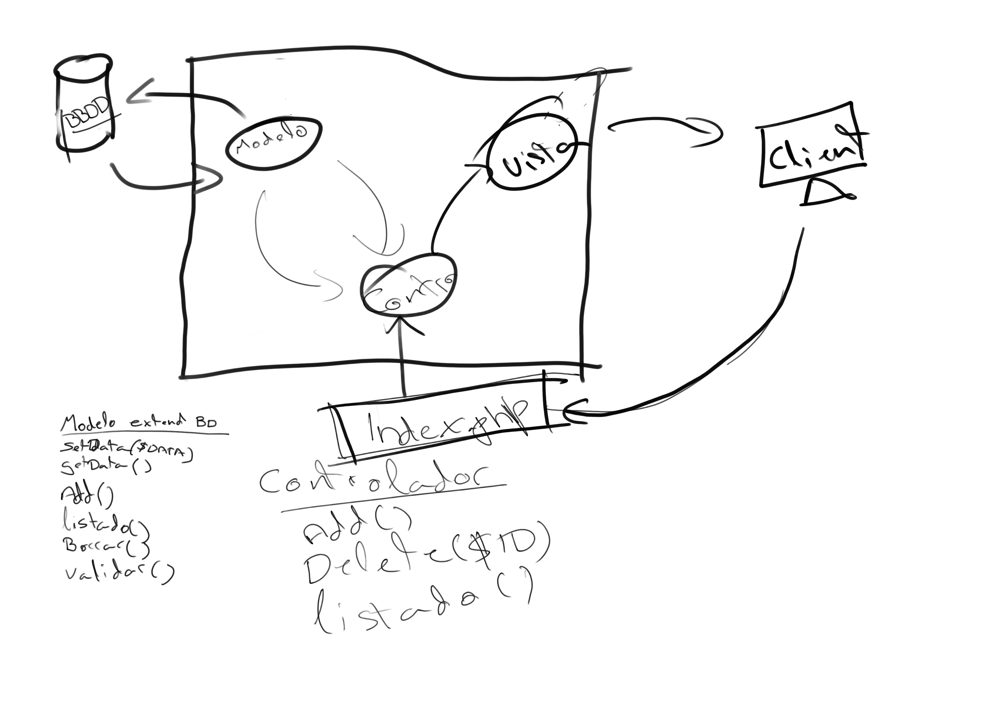

# ElefanteAzul-VanillaPHP

Proyecto pedagógico de lavadero de coches desarrollado en **PHP puro** con arquitectura **MVC**. Esta versión base se construyó sin frameworks para consolidar conceptos fundamentales, previo a la migración hacia Laravel en el proyecto [Elefante Azul](https://github.com/JoseLoder/ElefanteAzul).

## 🧰 Tecnologías utilizadas
- PHP (puro, sin frameworks)
- CSS personalizado
- Arquitectura MVC (Modelo-Vista-Controlador)

## 🗂 Estructura general del proyecto
Este repositorio muestra una implementación organizada basada en MVC, donde cada componente del sistema está claramente diferenciado:
- **Modelo**: Gestión de datos y lógica de negocio.
- **Vista**: Interfaz de usuario con CSS personalizado.
- **Controlador**: Coordinación entre modelo y vista.

## ✏️ Esquema de arquitectura
Se incluye un esquema visual dibujado a mano que muestra cómo se organiza el flujo interno del sistema bajo el patrón MVC.

## 📘 Notas finales
Este proyecto es parte de una serie formativa para demostrar dominio técnico en distintas etapas de desarrollo web. La evolución natural de este repositorio puede encontrarse en [Elefante Azul con Laravel](https://github.com/JoseLoder/ElefanteAzul).
